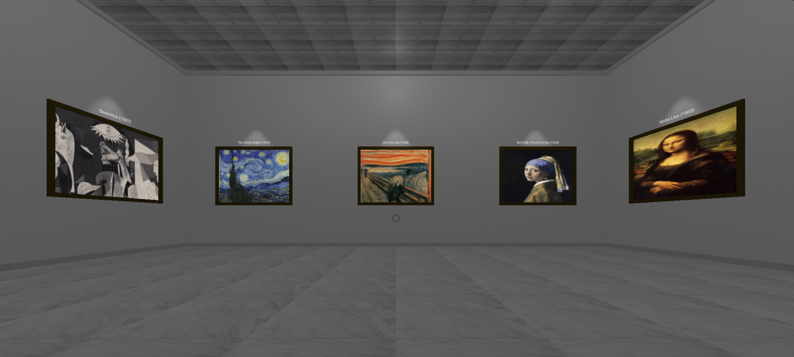

# VR Art Gallery

## Overview
An immersive virtual reality art gallery built entirely with client-side web technologies. Experience famous artworks in a 3D environment using A-Frame framework.

## Demo

## Features
* **Immersive 3D Environment** - Walk through a virtual museum space
* **Interactive Artworks** - View detailed information about each piece
* **Dynamic Lighting** - Spotlights highlight each artwork
* **Smooth Navigation** - Intuitive movement controls
* **Responsive Design** - Works on both desktop and mobile devices

## Prerequisites
* Any modern web browser with WebGL support
* No server required - runs entirely in the browser!

## Getting Started
1. Download the project files
2. Open `index.html` in your web browser
3. Use WASD/Arrow keys to move and mouse/touch to look around

## Controls

### Movement Controls (Arrow Keys)
* `↑` : Move forward
* `↓` : Move backward
* `←` : Strafe left
* `→` : Strafe right

### Camera Controls (WASD Keys)
* `W` : Look up
* `S` : Look down
* `A` : Look left
* `D` : Look right

### Interaction
* Hover over artwork: Display information panel

### Notes
* Movement is always relative to camera direction
* Vertical camera rotation is limited to prevent over-rotation
* Movement is bounded within museum walls